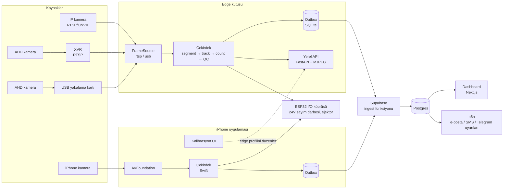

# 00 — Genel Bakış ve Mimari

## Amaç
Konveyör banttan geçen ürünleri (yumurta, un torbası ve kalibre edilebilen her ürün) **saymak**, her ürünü **bir kez muayene edip OK/NOK** kararı vermek, sonuçları panele, uyarı sistemine ve gerektiğinde PLC/ejektöre iletmek.

Üç satış senaryosu tek mimariyle karşılanır:
1. **Düşük bütçe:** iPhone + lamba + kıskaç. İşleme telefonda.
2. **Kamerası olan müşteri:** mevcut IP/AHD kamera + küçük bir edge kutusu (mini PC). İşleme kutuda.
3. **TRASSIR müşterisi:** TRASSIR sunucusuna bağlanan modül (F8, doğrulama gerekli).

## Mimari

## Bileşenler

| Bileşen | Sorumluluk | Doküman |
|---|---|---|
| Ortak sözleşmeler | Ürün profili, olay formatı, cihaz kaydı | `02-contracts.md` |
| Çekirdek algoritma | Arka plan farkı, izleme, sayım, QC | `03-algorithm.md` |
| iOS uygulaması | Telefonla sayım/QC, kalibrasyon, edge kameraları uzaktan kalibre etme, veri toplama | `04-ios-app.md` |
| Edge servisi | Çoklu RTSP/USB kamera, aynı çekirdek, yerel API, outbox | `05-edge-service.md` |
| Backend + dashboard | Olay toplama, dakikalık özet, OEE, NOK galerisi, cihaz sağlığı | `06-backend-dashboard.md` |
| I/O köprüsü | 24V sayım darbesi, gecikmeli ejektör darbesi, alarm lambası | `07-io-bridge-esp32.md` |
| TRASSIR | VMS entegrasyonu | `08-trassir-integration.md` |
| ML yol haritası | Veri toplama, anomali tespiti, YOLO dedektör | `09-ml-roadmap.md` |
| Saha kurulumu | Montaj, ışık, CCTV ayarları, kalibrasyon, kabul testi | `10-field-setup.md` |
| Uyarılar | n8n akışları | `../n8n/README.md` |
| Pazar notları | Rakip (Enao Vision) incelemesi, saha ipuçları, ürün fikirleri | `11-market-notes-enao.md` |
| Durum özeti | Yapılanlar, doğrulama, açık konular, sıradaki işler | `12-durum.md` |

## Temel tasarım kararları
1. **Önce klasik görüntü işleme, sonra ML.** Sabit kamera + tek yönlü akış arka plan farkı için ideal; model eğitimi gerekmez, sahada 1 dakikada kalibre edilir. ML (YOLO, anomali tespiti) klasik yöntemin zorlandığı yoğun/üst üste senaryolar ve görünüm tabanlı kalite kontrol için eklenir. Klasik hat, ML için **otomatik etiketleyici** olarak da kullanılır.
2. **Tek algoritma, iki dil.** Swift (iOS) ve Python (edge) aynı spesifikasyonu uygular; Python referanstır.
3. **Kaynaktan bağımsız çekirdek.** Çekirdek yalnızca "zaman damgalı gri seviye kare" alır. Kamera türü `FrameSource` arayüzünün arkasında kalır.
4. **Profil = taşınabilir JSON.** Bir ürün profili iPhone'da kalibre edilip edge kameraya (ya da tersi) aynen aktarılabilir. Kareye bağlı parametreler fps'e göre ölçeklenir (bkz. `03-algorithm.md` §7).
5. **Olaylar idempotent ve çevrimdışı dayanıklı.** Her olayın UUID'si var; outbox + yeniden deneme.
6. **Muayene ürün başına bir kez.** QC her karede değil, iz sayım çizgisini geçtiğinde en iyi karede çalışır. Hesap yükü düşük kalır.

## Sözlük
- **ROI:** İlgi alanı; yalnızca bu dikdörtgendeki pikseller işlenir.
- **Leke (blob):** Arka plandan farklı bağlı piksel bölgesi = ürün adayı.
- **İz (track):** Kareler boyunca aynı ürüne ait lekeler zinciri.
- **Çarpan (multiplicity):** Bir lekenin kaç üründen oluştuğu tahmini (alan / tek ürün alanı).
- **OK/NOK:** Kalite kontrolden geçti / kaldı.
- **Outbox:** Gönderilmeyi bekleyen olayların yerel kalıcı kuyruğu.
